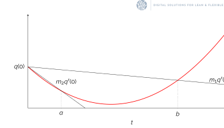

(solvers)=

# Solvers

The goal is to find all the voltages, currents and powers of the network that respect the equations introduced by each
element of the network.

More formally, we have to solve a system of $n$ nonlinear equations with $n$ variables:

```{math}
F: \mathbb{R}^n \to \mathbb{R}^n
```

Our goal is to find $x$ such as:

```{math}
F(x) = 0
```

As finding an exact solution of a nonlinear system is very difficult, we actually try to find $x$ such as:
```{math}
||F(x)||_{\infty} < \epsilon
```
With $\epsilon$ being the parameter `tolerance` that the user can choose (by default `1e-6`).


## Newton-Raphson

This is the classical Newton-Raphson solver.

We start by choosing an initial solution $x_0$ by propagating the voltages, or re-using the previous results if a load
flow has already been run (this behaviour actually depends on the `warm_start` parameter which default to `True`).
Then, multiple iterations are made with:

```{math}
:label: step
x_{n+1} = x_n - J_F^{-1}(x_n)F(x_n)
```

with $J_F$ the jacobian of $F$.

The iterations are stopped when we find $x_n$ such as $||F(x_n)||_{\infty} < \epsilon$, or when the number of iterations
has exceeded the parameter `max_iterations` (in which case we consider that the algorithm can't converge).

### Parameters

The user can specify one parameter:
- `"linear_solver"`: the linear solver used to compute $J_F^{-1}(x)F(x)$. Currently only `"SparseLU"` is available.

## Goldstein and Price

This is a variant of the classical Newton-Raphson algorithm with a linear search.

At each iteration we're choosing $x_{n+1}$ such as
```{math}
:label: linear_search_step
x_{n+1} = x_n + td(x_n)
```
with $d = -J_F^{-1}F$

For the classical Newton-Raphson algorithm, $t=1$ is chosen for the next iterate. The idea of the linear searches
(in our case the Goldstein and Price variant), is to find a "better" $t$ to improve the convergence of the
algorithm.

Let $g$ a function to be minimised:
```{math}
g &: \mathbb{R}^n \to \mathbb{R} \\
g(x) &:= \frac{1}{2} ||F(x)||_2
```

Let $q$ the function $g$ in the direction $d$:
```{math}
q &: \mathbb{R} \to \mathbb{R} \\
q(t) &:= g(x_n + td(x_n))
```

A search is made to find $t$ such as
```{math}
:label: goldstein_and_pric
m_2q'(0) \leq \frac{q(t) - q(0)}{t} \leq m_1q'(0)
```



On the above picture, any $t$ such as $a < t < b$ is satisfactory.

This $t$ is found by dichotomy with multiple iterations, but in most of the cases (especially when there are no flexible
loads in the network), only one iteration is needed. Thus, the Goldstein and Price variant is as fast as the classical
Newton-Raphson, while being more robust.

This $t$ is then used to compute $x_{n+1} = x_n + td(x_n)$

### Parameters

The user can specify 3 parameters:
- `"m1"` the first constant of the Goldstein and Price variant. By default: `0.1`.
- `"m2"` the second constant of the Goldstein and Price variant. By default: `0.9`.
(note that we should have $m_1 < m_2$).
- `"linear_solver"`: the linear solver used to compute $J_F^{-1}(x)F(x)$. Currently only `"SparseLU"` is available.
