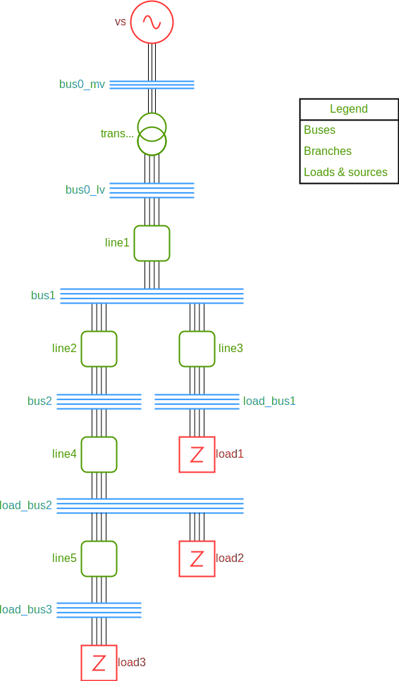

---
myst:
  html_meta:
    "description lang=en": |
      Roseau Load Flow enables fine modelling of flexible loads and sources with fully parameterisable control laws.
    "description lang=fr": |
      Roseau Load Flow permet la modélisation fine des charges flexibles et des sources avec des lois de contrôle
      entièrement paramétrables.
    "keywords lang=fr": simulation, charge, source, flexible, contrôle, P(U), PQ(U), écoulement de charge
    "keywords lang=en": simulation, flexible, control, load, source, P(U), PQ(U), load flow
---

(usage-flexible-loads)=

# Connecting flexible loads

Make sure you have followed the [getting started guide](Getting_Started.md) first.

Let's create a network with MV and LV elements connected via a transformer.

## Creating a network

This network contains a voltage source with a constant balanced voltage of 20 kV (phase-to-phase),
a Delta-Wye transformer and a small LV network.



```pycon
>>> import numpy as np
... import roseau.load_flow as rlf

>>> # Create a MV bus with a voltage source
... bus0_mv = rlf.Bus(id="bus0_mv", phases="abc")
... un = 20e3  # V
... source_voltages = [un, un * np.exp(-2j * np.pi / 3), un * np.exp(2j * np.pi / 3)]
... vs = rlf.VoltageSource(id="vs", bus=bus0_mv, phases="abc", voltages=source_voltages)
... # Set the MV potential reference
... pref_mv = rlf.PotentialRef(id="pref_mv", element=bus0_mv)

>>> # Create a LV bus and connect its neutral to the ground
... bus0_lv = rlf.Bus(id="bus0_lv", phases="abcn")
... ground = rlf.Ground(id="gnd")
... # Set the ground potential to 0V
... pref_lv = rlf.PotentialRef(id="pref_lv", element=ground)
... # Connect the ground to the neutral of the LV bus
... ground.connect(bus0_lv)

>>> # Add a MV/LV transformer
... tp = rlf.TransformerParameters.from_open_and_short_circuit_tests(
...     "160_kVA",
...     "Dyn11",
...     sn=160.0 * 1e3,
...     uhv=20e3,
...     ulv=400.0,
...     i0=2.3 / 100,
...     p0=460.0,
...     psc=2350.0,
...     vsc=4.0 / 100,
... )
... transformer = rlf.Transformer(
...     id="transfo",
...     bus1=bus0_mv,
...     bus2=bus0_lv,
...     phases1="abc",
...     phases2="abcn",
...     parameters=tp,
...     tap=1.025,
... )

>>> # Add the LV network elements
... lp = rlf.LineParameters.from_geometry(
...     "U_AL_150",
...     line_type=rlf.LineType.UNDERGROUND,
...     conductor_type=rlf.ConductorType.AL,
...     insulator_type=rlf.InsulatorType.PVC,
...     section=150,
...     section_neutral=150,
...     height=rlf.Q_(-1.5, "m"),
...     external_diameter=rlf.Q_(40, "mm"),
... )
... bus1 = rlf.Bus(id="bus1", phases="abcn")
... bus2 = rlf.Bus(id="bus2", phases="abcn")
... load_bus1 = rlf.Bus(id="load_bus1", phases="abcn")
... load_bus2 = rlf.Bus(id="load_bus2", phases="abcn")
... load_bus3 = rlf.Bus(id="load_bus3", phases="abcn")
... line1 = rlf.Line(
...     id="line1",
...     bus1=bus0_lv,
...     bus2=bus1,
...     phases="abcn",
...     ground=ground,
...     parameters=lp,
...     length=0.5,
... )  # km
... line2 = rlf.Line(
...     id="line2",
...     bus1=bus1,
...     bus2=bus2,
...     phases="abcn",
...     ground=ground,
...     parameters=lp,
...     length=0.4,
... )
... line3 = rlf.Line(
...     id="line3",
...     bus1=bus1,
...     bus2=load_bus1,
...     phases="abcn",
...     ground=ground,
...     parameters=lp,
...     length=0.3,
... )
... line4 = rlf.Line(
...     id="line4",
...     bus1=bus2,
...     bus2=load_bus2,
...     phases="abcn",
...     ground=ground,
...     parameters=lp,
...     length=0.3,
... )
... line5 = rlf.Line(
...     id="line5",
...     bus1=load_bus2,
...     bus2=load_bus3,
...     phases="abcn",
...     ground=ground,
...     parameters=lp,
...     length=0.4,
... )
... si = -3e3  # VA, negative as it is production
... load1 = rlf.PowerLoad(id="load1", bus=load_bus1, phases="abcn", powers=[si, si, si])
... load2 = rlf.PowerLoad(id="load2", bus=load_bus2, phases="abcn", powers=[si, si, si])
... load3 = rlf.PowerLoad(id="load3", bus=load_bus3, phases="abcn", powers=[si, 0, 0])

>>> # Create the network
... en = rlf.ElectricalNetwork.from_element(bus0_mv)
```

Then, the load flow can be solved and the results can be retrieved.

```pycon
>>> en.solve_load_flow()
(2, 1.8595619621919468e-07)
>>> abs(load_bus3.res_voltages)
array([243.66463933, 232.20612714, 233.55093129]) <Unit('volt')>
```

The flexible loads are loads that implement some basic controls such as $P(U)$, $Q(U)$ or $PQ(U)$.

## $P(U)$ control

Let's remove `load3` from the network and add a flexible load as a replacement. A flexible load
is a normal `PowerLoad` with a `flexible_params` argument that takes a list of`FlexibleParameter`.

We first create a `FlexibleParameter` using its class method `p_max_u_production`. It returns a
flexible parameter instance that reduces the active production when the voltage is higher than
`u_up` volts and stops the production when the voltage reaches `u_max`. The `s_max` argument
defines the maximum allowed apparent power of the production plant. In the example below,
`u_up=240 V`, `u_max=250 V` and `s_max=4 kVA`.

After that, a flexible load representing a PV plant is created. Its apparent power is fixed at
`[si, 0, 0]` VA with `si` a negative value (negative because it is production). Theses apparent
powers define the maximum power this load can produce. The `flexible_params` argument takes a
list of `FlexibleParameter` instances, one per phase. For the first phase, the $P(U)$ control is
used. For the two other phases, there is no control at all thus the `constant` class method is
used.

As a consequence, the provided apparent power for phase `'a'` is the maximum that can be produced
(potentially modified by the $P(U)$ control) and the provided apparent power for phases `'b'` and
`'c'` is the desired production as the flexible parameter is defined as `constant`.

```pycon
>>> # Let's make the load 3 flexible with a p(u) control to reduce the voltages constraints
... en.loads["load3"].disconnect()
... fp = rlf.FlexibleParameter.p_max_u_production(u_up=240, u_max=250, s_max=4000)  # V and VA
... flexible_load = rlf.PowerLoad(
...     id="load3",
...     bus=load_bus3,
...     phases="abcn",
...     powers=[si, 0, 0],  # W
...     flexible_params=[
...         fp,
...         rlf.FlexibleParameter.constant(),
...         rlf.FlexibleParameter.constant(),
...     ],
... )
```

The load flow can now be run again. You can see that the voltage magnitude has changed. Note that
the voltage magnitude for phase `'a'` was 240 V above without the $P(U)$ control, thus the control
has been activated in this run.

```pycon
>>> en.solve_load_flow()
(4, 1.453686784545e-07)
>>> abs(load_bus3.res_voltages)
array([243.08225748, 232.46046866, 233.62854073]) <Unit('volt')>
```

The actually produced power of the flexible load is a result of the computation and can be
accessed using the `res_flexible_powers` property of the load.

```pycon
>>> flexible_load.res_flexible_powers
array([-2757.8035271+0.j, 0.+0.j, 0.+0.j]) <Unit('volt_ampere')>
```

```{note}
The flexible powers are the powers that flow in the load elements and not in the lines. These are
only different in case of delta loads. To access the powers that flow in the lines, use the
`res_powers` property instead.
```

Here, one can note that:

- The active power for the phase `'a'` is negative meaning production;
- The actual value of this active power is lower that the one requested as the control was activated;
- The power for phases `'b'` and `'c'` is 0 VA as expected.

## $PQ(U)$ control

Now, let's remove the flexible load that we have added in the previous section and add a new
flexible load implementing a $PQ(U)$ control instead.

As before, we first create a `FlexibleParameter` but this time, we will use the
`pq_u_production` class method. It requires several arguments:

- `up_up` and `up_max`: the voltages defining the interval of the $P(U)$ control activation.
  Below `up_up`, no control is applied and above `u_max`, the production is totally shut down.
- `uq_min`, `uq_down`, `uq_up` and `uq_max` which are the voltages defining the $Q(U)$ control
  activation.
  - Below `uq_min`, the power plant produces the maximum possible reactive power.
  - Between `uq_down` and `uq_up`, there is no $Q(U)$ control.
  - Above `uq_max`, the power plant consumes the maximum possible reactive power.

In the example below, as the new load is a production load, only the `up_up`, `up_max`, `uq_up`
and `uq_max` are of interests. The $Q(U)$ control starts its action at 235 V and is fully
exhausted at 240 V. After that, the $P(U)$ is activated and is exhausted at 250 V where the
production is totally shut down.

```pycon
>>> # Let's try with PQ(u) control, by injecting reactive power before reducing active power
... en.loads["load3"].disconnect()
... fp = rlf.FlexibleParameter.pq_u_production(
...     up_up=240,
...     up_max=250,
...     uq_min=200,
...     uq_down=210,
...     uq_up=235,
...     uq_max=240,
...     s_max=4000,  # V and VA
... )
... flexible_load = rlf.PowerLoad(
...     id="load3",
...     bus=load_bus3,
...     phases="abcn",
...     powers=[si, 0, 0],
...     flexible_params=[
...         fp,
...         rlf.FlexibleParameter.constant(),
...         rlf.FlexibleParameter.constant(),
...     ],
... )
```

The load flow can be solved again.

```pycon
>>> en.solve_load_flow()
(6, 1.8576776876e-07)
>>> abs(load_bus3.res_voltages)
array([239.5133208 , 230.2108052 , 237.59184615]) <Unit('volt')>
>>> flexible_load.res_flexible_powers
array([-2566.23768012+3068.29336425j, 0.+0.j, 0.+0.j]) <Unit('volt_ampere')>
```

One can note that this time, the phase `'a'` consumes reactive power to limit the voltage rise in
the network. Moreover, the magnitude of the power on phase `'a'` is approximately $4 kVA$ which is
the maximum allowed apparent power for `load3`. In order to maintain this maximum, a
[Euclidean projection](models-flexible_load-projections) has been used.
