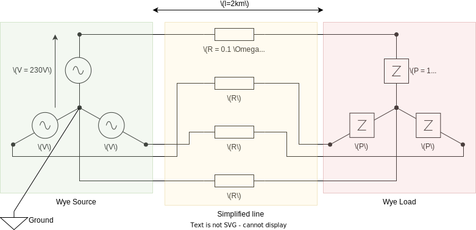

(usage-getting-started)=

# Getting started

_Make sure you have followed the_ [installation instructions](../Installation.md).

In this tutorial you will learn how to:

1. [Create a simple electrical network with one source and one load](gs-creating-network);
2. [Solve a load flow](gs-solving-load-flow);
3. [Get the results of the load flow](gs-getting-results);
4. [Analyze the results](gs-analysis-and-violations);
5. [Update the elements of the network](gs-updating-elements);
6. [Save the network to a file and load a saved network](gs-network-json);

(gs-creating-network)=

## Creating a network

An electrical network can be built by assembling basic elements described in the [Models section](../models/index.md).
The following is a summary of the available elements:

- Buses:

  - `Bus`: A basic multi-phase electrical bus.

- Branches:

  - `Line`: A line connects two buses. The physical parameters of the line like its impedance are
    defined by a `LineParameters` object.
  - `Switch`: A basic switch element.
  - `Transformer`: A generic transformer. The physical parameters of the transformer like its
    impedance and winding configuration are defined by a `TransformerParameters` object.

- Loads:

  The ZIP load model is available via the following classes:

  - `ImpedanceLoad`: A constant impedance (Z) load: $S = |V|^2 \times \overline{Z}$, $|S|$ is proportional to $|V|^2$.
  - `CurrentLoad` A constant current (I) load: $S = V \times \overline{I}$, $|S|$ is proportional to $|V|^1$.
  - `PowerLoad`: A constant power (P) load: $S = \mathrm{constant}$, $|S|$ is proportional to $|V|^0$.

  A power load can be made flexible (controllable) by using the following class:

  - `FlexibleParameter`: This object defines the parameters of the flexible load's control (Maximum power, projection,
    type, etc.)

  Note that flexible loads are an advanced feature that most users don't need. They are explained in details [here](usage-flexible-loads).

- Sources:

  - `VoltageSource`: Represents an infinite power source with a constant voltage.

- Others:
  - `Ground`: A ground acts as a perfect conductor. If two elements are connected to the ground, the potentials at the
    connection points are always equal.
  - `PotentialRef`: A potential reference sets the reference of potentials in the network. It can be connected to
    buses or grounds.

Let's use some of these elements to build the following network with a voltage source, a simple
line and a constant power load. This network is a low voltage network (three-phase + neutral wire).



It leads to the following code

```pycon
>>> import numpy as np
... from roseau.load_flow import *

>>> # Nominal phase-to-neutral voltage
... un = 400 / np.sqrt(3)  # In Volts

>>> # Optional network limits (for results analysis only)
... u_min = 0.9 * un  # V
... u_max = 1.1 * un  # V
... i_max = 500.0  # A

>>> # Create two buses (notice the phases of LV buses contain the neutral)
... source_bus = Bus(id="sb", phases="abcn", min_voltage=u_min, max_voltage=u_max)
... load_bus = Bus(id="lb", phases="abcn", min_voltage=u_min, max_voltage=u_max)

>>> # Define the reference of potentials to be the neutral of the source bus
... ground = Ground(id="gnd")
... # Fix the potential of the ground at 0 V
... pref = PotentialRef(id="pref", element=ground)
... ground.connect(source_bus, phase="n")

>>> # Create a LV source at the first bus
... # (phase-to-neutral voltage because the source is connected to the neutral)
... source_voltages = un * np.exp([0, -2j * np.pi / 3, 2j * np.pi / 3])
... vs = VoltageSource(id="vs", bus=source_bus, voltages=source_voltages)

>>> # Add a load at the second bus
... load = PowerLoad(id="load", bus=load_bus, powers=[10e3 + 0j, 10e3, 10e3])  # VA

>>> # Add a LV line between the source bus and the load bus
... # R = 0.1 Ohm/km, X = 0
... lp = LineParameters(
...     "lp", z_line=(0.1 + 0.0j) * np.eye(4, dtype=complex), max_current=i_max
... )
... line = Line(id="line", bus1=source_bus, bus2=load_bus, parameters=lp, length=2.0)
```

Notice how the phases of the load, line and source are not explicitly given. They are inferred to be
`"abcn"` from the buses they are connected to. You can also explicitly declare the phases of these
elements. For example, to create a delta-connected source instead, you can use the following code:

```pycon
>>> source_voltages = un * np.sqrt(3) * np.exp([0, -2j * np.pi / 3, 2j * np.pi / 3])
... vs = VoltageSource(
...     id="vs", bus=source_bus, voltages=source_voltages, phases="abc"
... )
```

Note the use of `un * np.sqrt(3)` in the source voltage as it now represents the phase-to-phase
voltage. This is because everywhere in `roseau-load-flow`, the `voltages` of an element depend on
the element's `phases`. Voltages of elements connected in a _Star (wye)_ configuration (elements
that have a neutral connection indicated by the presence of the `'n'` char in their `phases`
attribute) are the **phase-to-neutral** voltages. Voltages of elements connected in a _Delta_
configuration (elements that do not have a neutral connection indicated by the absence of the
`'n'` char from their `phases` attribute) are the **phase-to-phase** voltages.

At this point, all the basic elements of the network have been defined and connected. Now,
everything can be encapsulated in an `ElectricalNetwork` object, but first, some important
notes on the `Ground` and `PotentialRef` elements:

````{important}
The `Ground` element does not have a fixed potential as one would expect from a real ground
connection. The potential reference (0 Volts) is defined by the `PotentialRef` element that
itself can be connected to any bus or ground in the network. This is to give more flexibility
for the user to define the potential reference of their network.

A `PotentialRef` defines the potential reference for the network. It is a mandatory reference
for the load flow resolution to be well-defined. A network MUST have one and only one potential
reference per a galvanically isolated section.

```{note}
The `Ground` element is not required in this simple network as it is connected to a single
element. No current will flow through the ground and no two points in the network will be forced
to have the same potential. In this scenario you are allowed to define the potential reference
directly on the bus element: `pref = PotentialRef(id="pref", element=source_bus, phase="n")` and
not bother with creating the ground element at all.
```
````

An `ElectricalNetwork` object can now be created using the `from_element` constructor. The source
bus `source_bus` is given to this constructor. All the elements connected to this bus are
automatically included into the network.

```pycon
>>> en = ElectricalNetwork.from_element(source_bus)
```

(gs-solving-load-flow)=

## Solving a load flow

A license is required. Please contact us at contact@roseautechnologies.com to get a license key.
Once you have a license key, you can activate by following the instructions in the
[License activation page](license-activation).

Then, the load flow can be solved by calling the `solve_load_flow` method of the `ElectricalNetwork`

```pycon
>>> en.solve_load_flow()
(2, 1.8595619621919468e-07)
```

It returns the number of iterations performed by the _Newton-Raphson_ solver, and the residual
error after convergence. Here, the load flow converged in 2 iterations with a residual error of
$1.86 \times 10^{-7}$.

(gs-getting-results)=

## Getting the results

The results are now available for every element of the network. Results can be accessed through
special properties prefixed with `res_` on each element object. For instance, the potentials
of the `load_bus` can be accessed using the property `load_bus.res_potentials`. It contains 4
values which are the potentials of its phases `a`, `b`, `c` and `n` (neutral). The potentials
are returned as complex numbers. Calling `abs(load_bus.res_potentials)` gives you the magnitude
of the load's potentials (in Volts) and `np.angle(load_bus.res_potentials)` gives their angle
(phase shift) in radians.

Roseau Load Flow uses [Pint](https://pint.readthedocs.io/en/stable/) `Quantity` objects to
present the data in unit-agnostic way for the user. Most input data (load powers, source voltages,
etc.) are expected to be either given in SI units or using the pint Quantity interface for non-SI
units (example below). Exceptions to this rule include the `length` parameter of the `Line` class
with the default unit being Kilometers (km) and the `section` parameter of the `LineParameters`
class with the default unit being Square Millimeters (mm²).

In the following example, we create a load with powers expressed in kVA:

```python
from roseau.load_flow import Q_

load = PowerLoad(id="load", bus=load_bus, phases="abcn", powers=Q_([10, 10, 10], "kVA"))
```

The results returned by the `res_` properties are also `Quantity` objects.

### Available results

The available results depend on the type of element. The following table lists the available
results for each element type:

| Element type                                | Available results                                                                                                                                       |
| ------------------------------------------- | ------------------------------------------------------------------------------------------------------------------------------------------------------- |
| `Bus`                                       | `res_potentials`, `res_voltages`, `res_violated`                                                                                                        |
| `Line`                                      | `res_currents`, `res_powers`, `res_potentials`, `res_voltages`, `res_series_power_losses`, `res_shunt_power_losses`, `res_power_losses`, `res_violated` |
| `Transformer`                               | `res_currents`, `res_powers`, `res_potentials`, `res_voltages`, `res_violated`                                                                          |
| `Switch`                                    | `res_currents`, `res_powers`, `res_potentials`, `res_voltages`                                                                                          |
| `ImpedanceLoad`, `CurrentLoad`, `PowerLoad` | `res_currents`, `res_powers`, `res_potentials`, `res_voltages`, `res_flexible_powers`&#8270;                                                            |
| `VoltageSource`                             | `res_currents`, `res_powers`, `res_potentials`, `res_voltages`                                                                                          |
| `Ground`                                    | `res_potential`                                                                                                                                         |
| `PotentialRef`                              | `res_current` _(Always zero for a successful load flow)_                                                                                                |

&#8270;: `res_flexible_powers` is only available for flexible loads (`PowerLoad`s with `flexible_params`). You'll see
an example on the usage of flexible loads in the _Flexible Loads_ page.

### Getting results per object

In order to get the potentials or voltages of a bus, use the `res_potentials` or `res_voltages`
properties of buses as follows:

```pycon
>>> load_bus.res_potentials
array([ 2.21928183e+02-2.60536682e-18j, -1.10964092e+02-1.92195445e+02j,
       -1.10964092e+02+1.92195445e+02j,  2.68637675e-15-6.67652444e-17j]) <Unit('volt')>
```

As the results are _pint quantities_, they can be converted to different units easily.

```pycon
>>> abs(load_bus.res_voltages).to("kV")  # Get a Quantity in kV
array([0.22192818, 0.22192818, 0.22192818]) <Unit('kilovolt')>
>>> abs(load_bus.res_voltages).m_as("kV")  # Get the magnitude in kV
array([0.22192818, 0.22192818, 0.22192818])
>>> abs(load_bus.res_voltages).m  # Get the default magnitude (Volts)
array([221.928183, 221.928183, 221.928183])
```

The currents of the line are available using the `res_currents` property of the `line` object.
It contains two arrays:

- the first is the current flowing from the first bus of the line to the second bus of the line.
  It contains 4 values: one per phase and the neutral current.
- the second is the current flowing from the second bus of the line to the first bus of the line.

Here, the sum of these currents is 0 as we have chosen a simple line model, i.e, a line with only
series impedance elements without shunt components. If shunt components were modelled, the sum
would have been non-zero.

```pycon
>>> line.res_currents
(array([ 4.50596216e+01+1.30268341e-17j, -2.25298108e+01-3.90227770e+01j,
        -2.25298108e+01+3.90227770e+01j, -1.34318838e-14+3.33826222e-16j]) <Unit('ampere')>,
 array([-4.50596216e+01-1.30268341e-17j,  2.25298108e+01+3.90227770e+01j,
         2.25298108e+01-3.90227770e+01j,  1.34318838e-14-3.33826222e-16j]) <Unit('ampere')>)
```

### Dataframe network results

The results can also be retrieved for the entire network using `res_` properties of the
`ElectricalNetwork` instance as pandas {doc}` DataFrames <pandas:reference/frame>`.

Available results for the network are:

- `res_buses`: Buses potentials indexed by _(bus id, phase)_
- `res_buses_voltages`: Buses voltages and voltage limits indexed by _(bus id, voltage phase)_
- `res_branches`: Branches currents, powers, and potentials indexed by _(branch id, phase)_
- `res_transformers`: Transformers currents, powers, potentials, and power limits indexed by
  _(transformer id, phase)_
- `res_lines`: Lines currents, powers, potentials, series losses, series currents, and current
  limits indexed by _(line id, phase)_
- `res_switches`: Switches currents, powers, and potentials indexed by _(switch id, phase)_
- `res_loads`: Loads currents, powers, and potentials indexed by _(load id, phase)_
- `res_loads_voltages`: Loads voltages indexed by _(load id, voltage phase)_
- `res_loads_flexible_powers`: Loads flexible powers (only for flexible loads) indexed by
  _(load id, phase)_
- `res_sources`: Sources currents, powers, and potentials indexed by _(source id, phase)_
- `res_grounds`: Grounds potentials indexed by _ground id_
- `res_potential_refs`: Potential references currents indexed by _potential ref id_ (always zero
  for a successful load flow)

All the results are complex numbers. You can always access the magnitude of the results using
the `abs` function and the angle in radians using the `np.angle` function. For instance,
`abs(network.res_loads)` gives you the magnitude of the loads' results in SI units.

Below are the results of the load flow for `en`:

```{note}
All the following tables are rounded to 2 decimals to be properly displayed.
```

```pycon
>>> en.res_buses
```

| bus_id | phase |      potential |
| :----- | :---- | -------------: |
| sb     | a     |      230.94+0j |
| sb     | b     |   -115.47-200j |
| sb     | c     |   -115.47+200j |
| sb     | n     |             0j |
| lb     | a     |      221.93-0j |
| lb     | b     | -110.96-192.2j |
| lb     | c     | -110.96+192.2j |
| lb     | n     |            -0j |

```pycon
>>> en.res_buses_voltages
```

| bus_id | phase |        voltage | min_voltage | max_voltage | violated |
| :----- | :---- | -------------: | ----------: | ----------: | :------- |
| sb     | an    |      230.94+0j |     207.846 |     254.034 | False    |
| sb     | bn    |   -115.47-200j |     207.846 |     254.034 | False    |
| sb     | cn    |   -115.47+200j |     207.846 |     254.034 | False    |
| lb     | an    |      221.93-0j |     207.846 |     254.034 | False    |
| lb     | bn    | -110.96-192.2j |     207.846 |     254.034 | False    |
| lb     | cn    | -110.96+192.2j |     207.846 |     254.034 | False    |

```pycon
>>> en.res_branches
```

| branch_id | phase |      current1 |     current2 |      power1 |    power2 |   potential1 |     potential2 |
| :-------- | :---- | ------------: | -----------: | ----------: | --------: | -----------: | -------------: |
| line      | a     |      45.06+0j |    -45.06-0j | 10406.07-0j | -10000+0j |    230.94+0j |      221.93-0j |
| line      | b     | -22.53-39.02j | 22.53+39.02j | 10406.07+0j | -10000-0j | -115.47-200j | -110.96-192.2j |
| line      | c     | -22.53+39.02j | 22.53-39.02j | 10406.07-0j | -10000+0j | -115.47+200j | -110.96+192.2j |
| line      | n     |            0j |          -0j |          0j |       -0j |           0j |            -0j |

```pycon
>>> en.res_lines
```

| line_id | phase |      current1 |     current2 |      power1 |    power2 |   potential1 |     potential2 | series_losses | series_current | max_current | violated |
| :------ | :---- | ------------: | -----------: | ----------: | --------: | -----------: | -------------: | ------------: | -------------: | ----------: | :------- |
| line    | a     |      45.06-0j |    -45.06+0j | 10406.07+0j | -10000-0j |    230.94+0j |      221.93+0j |     406.07-0j |       45.06-0j |         500 | False    |
| line    | b     | -22.53-39.02j | 22.53+39.02j | 10406.07+0j | -10000-0j | -115.47-200j | -110.96-192.2j |     406.07-0j |  -22.53-39.02j |         500 | False    |
| line    | c     | -22.53+39.02j | 22.53-39.02j | 10406.07-0j | -10000+0j | -115.47+200j | -110.96+192.2j |     406.07+0j |  -22.53+39.02j |         500 | False    |
| line    | n     |         -0-0j |           0j |       -0+0j |       -0j |           0j |             0j |           -0j |          -0-0j |         500 | False    |

```pycon
>>> en.res_transformers
```

| transformer_id | phase | current1 | current2 | power1 | power2 | potential1 | potential2 | max_power | violated |
| -------------- | ----- | -------- | -------- | ------ | ------ | ---------- | ---------- | --------- | -------- |

```pycon
>>> en.res_switches
```

| switch_id | phase | current1 | current2 | power1 | power2 | potential1 | potential2 |
| --------- | ----- | -------- | -------- | ------ | ------ | ---------- | ---------- |

```pycon
>>> en.res_loads
```

| load_id | phase |       current |    power |      potential |
| :------ | :---- | ------------: | -------: | -------------: |
| load    | a     |      45.06+0j | 10000-0j |      221.93-0j |
| load    | b     | -22.53-39.02j | 10000-0j | -110.96-192.2j |
| load    | c     | -22.53+39.02j | 10000+0j | -110.96+192.2j |
| load    | n     |            0j |       0j |            -0j |

```pycon
>>> en.res_loads_voltages
```

| load_id | phase |        voltage |
| :------ | :---- | -------------: |
| load    | an    |      221.93+0j |
| load    | bn    | -110.96-192.2j |
| load    | cn    | -110.96+192.2j |

```pycon
>>> en.res_sources
```

| source_id | phase |      current |        power |    potential |
| :-------- | :---- | -----------: | -----------: | -----------: |
| vs        | a     |    -45.06-0j | -10406.07+0j |    230.94+0j |
| vs        | b     | 22.53+39.02j | -10406.07-0j | -115.47-200j |
| vs        | c     | 22.53-39.02j | -10406.07+0j | -115.47+200j |
| vs        | n     |           0j |           0j |           0j |

```pycon
>>> en.res_grounds
```

| ground_id | potential |
| :-------- | --------: |
| gnd       |        0j |

```pycon
>>> en.res_potential_refs
```

| potential_ref_id | current |
| :--------------- | ------: |
| pref             |      0j |

Using the `transform` method of data frames, the results can easily be converted from complex values
to magnitude and angle values.

```pycon
>>> en.res_buses_voltages["voltage"].transform([np.abs, np.angle])
```

| bus_id | phase | absolute |       angle |
| :----- | :---- | -------: | ----------: |
| sb     | an    |   230.94 |           0 |
| sb     | bn    |   230.94 |     -2.0944 |
| sb     | cn    |   230.94 |      2.0944 |
| lb     | an    |  221.928 | 2.89102e-19 |
| lb     | bn    |  221.928 |     -2.0944 |
| lb     | cn    |  221.928 |      2.0944 |

Or, if you prefer degrees:

```pycon
>>> import functools as ft
... en.res_buses_voltages["voltage"].transform([np.abs, ft.partial(np.angle, deg=True)])
```

| bus_id | phase | absolute |       angle |
| :----- | :---- | -------: | ----------: |
| sb     | an    |   230.94 |           0 |
| sb     | bn    |   230.94 |        -120 |
| sb     | cn    |   230.94 |         120 |
| lb     | an    |  221.928 | 1.65643e-17 |
| lb     | bn    |  221.928 |        -120 |
| lb     | cn    |  221.928 |         120 |

(gs-analysis-and-violations)=

## Analyzing the results and detecting violations

In the example network above, `min_voltage` and `max_voltage` arguments were passed to the `Bus`
constructor and `max_current` was passed to the `LineParameters` constructor. These arguments
define the limits of the network that can be used to check if the network is in a valid state
or not. Note that these limits have no effect on the load flow calculation.

If you set `min_voltage` or `max_voltage` on a bus, the `res_violated` property will tell you if
the voltage limits are violated or not at this bus. Here, the voltage limits are not violated.

```pycon
>>> load_bus.res_violated
False
```

Similarly, if you set `max_current` on a line, the `res_violated` property will tell you if the
current loading of the line in any phase exceeds the limit. Here, the current limit is not violated.

```pycon
>>> line.res_violated
False
```

The power limit of the transformer can be defined using the `max_power` argument of the
`TransformerParameters`. Transformers also have a `res_violated` property that indicates if the
power loading of the transformer exceeds the limit.

The data frame results on the electrical network also include a `violated` column that indicates if
the limits are violated or not for the corresponding element.

```{tip}
You can use the {meth}`Bus.propagate_limits() <roseau.load_flow.Bus.propagate_limits>` method to
propagate the limits from a bus to buses connected to it galvanically (i.e. via lines or switches).
```

(gs-updating-elements)=

## Updating elements of the network

Network elements can be updated. Here, the load's power values are changed to create an
unbalanced situation.

```pycon
>>> load.powers = Q_([15, 0, 0], "kVA")
>>> en.solve_load_flow()
(3, 1.686343545e-07)
>>> load_bus.res_potentials
array([ 216.02252269  +0.j, -115.47005384-200.j, -115.47005384+200.j, 14.91758499  +0.j]) <Unit('volt')>
```

Notice how the change was taken into account where the introduced unbalance manifested in the neutral's
potential of the bus no longer being close to 0 V.

More information on modifying the network elements can be found in the [Modifying a network](usage-modifying-network) page.

(gs-network-json)=

## Saving/loading the network

An electrical network can be written to a JSON file, for later analysis or for sharing with others,
using the {meth}`~roseau.load_flow.ElectricalNetwork.to_json` method.

```pycon
>>> en.to_json("my_network.json")
```

```{warning}
The `to_json` method will overwrite the file if it already exists.
```

To load the network from a JSON file, use the {meth}`~roseau.load_flow.ElectricalNetwork.from_json` method.

```pycon
>>> en = ElectricalNetwork.from_json("my_network.json")
```

By default, the `to_json` and `from_json` methods will include the load flow results if they are
available and are valid. If you want to save/load the network without the results, you can pass
`include_results=False` to these methods.

Note that calling the `to_json()` method on a network with invalid results (say after an element
has been modified) will raise an exception. In this case, you can use the `include_results=False`
option to save the network without the results or you can call the `solve_load_flow()` method to
update the results before saving the network.

```{important}
We do not recommend modifying the JSON file manually. The content of the JSON file is not
guaranteed to be stable across different versions of the library and should be considered an
internal representation of the network. Any changes to the JSON file should be done through the
`ElectricalNetwork` object otherwise it may lead to unexpected behavior.
```
