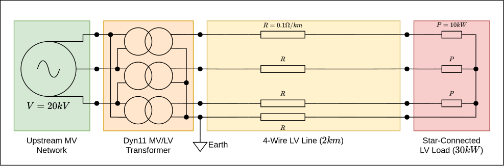

(usage-getting-started)=

# Getting started

*Make sure you have followed the* [installation instructions](../Installation.md).

In this tutorial you will learn how to:

1. [Create a simple electrical network with one source and one load](gs-creating-network);
2. [Solve a load flow](gs-solving-load-flow);
3. [Get the results of the load flow](gs-getting-results);
4. [Update the elements of the network](gs-updating-elements);
5. [Save the network and the results to the disk for later analysis](gs-saving-network);
6. [Load the saved network and the results from the disk](gs-loading-network).

(gs-creating-network)=

## Creating a network

An electrical network can be built by assembling basic elements described in the [Models section](../models/index.md).
The following is a summary of the available elements:

* Buses:
    * `Bus`: An electrical bus.

* Branches:
    * `Line`: A line connects two buses. The parameters of the line are defined by a `LineParameters` object.
    * `LineParameters`: This object defines the parameters of a line  (model, impedance, etc.)
    * `Switch`: A basic switch element.
    * `Transformer`: A generic transformer. The parameters of the transformer are defined by a `TransformerParameters`
      object.
    * `TransformerParameters`: This object defines the parameters of a transformer (model, windings, etc.)

* Loads:
  The ZIP load model is available via the following classes:
    * `ImpedanceLoad`: A constant impedance (Z) load: $S = |V|^2 \times \overline{Z}$, $|S|$ is proportional to $|V|^2$.
    * `CurrentLoad` A constant current (I) load: $S = V \times \overline{I}$, $|S|$ is proportional to $|V|^1$.
    * `PowerLoad`: A constant power (P) load: $S = \mathrm{constant}$, $|S|$ is proportional to $|V|^0$.

  A power load can be made flexible (controllable) by using the following class:
    * `FlexibleParameter`: This object defines the parameters of the flexible load's control (Maximum power, projection,
      type, etc.)

  Note that flexible loads are an advanced feature that most users don't need. They are explained in details [here](usage-flexible-loads).

* Sources:
    * `VoltageSource`: Represents an infinite power source with a constant voltage.

* Others:
    * `Ground`: A ground acts as a perfect conductor. If two elements are connected to the ground, the potentials at the
      connection points are always equal.
    * `PotentialRef`: A potential reference sets the reference of potentials in the network. It can be connected to
      buses or grounds.

For a more detailed description of the elements, please refer to the [API reference](../autoapi/roseau/load_flow/models/index).

Let's use some of these elements to build the following network with a voltage source, a simple
line and a constant power load. This network is a low voltage network (three-phase + neutral wire).



It leads to the following code

```pycon
>>> import numpy as np
... from roseau.load_flow import *

>>> # Create two buses
... source_bus = Bus(id="sb", phases="abcn")
... load_bus = Bus(id="lb", phases="abcn")

>>> # Define the reference of potentials to be the neutral of the source bus
... ground = Ground(id="gnd")
... # Fix the potential of the ground at 0 V
... pref = PotentialRef(id="pref", element=ground)
... ground.connect(source_bus, phase="n")

>>> # Create a LV source at the first bus
... # Volts (phase-to-neutral because the source is connected to the neutral)
... un = 400 / np.sqrt(3)
... source_voltages = [un, un * np.exp(-2j * np.pi / 3), un * np.exp(2j * np.pi / 3)]
... vs = VoltageSource(id="vs", bus=source_bus, voltages=source_voltages)

>>> # Add a load at the second bus
... load = PowerLoad(id="load", bus=load_bus, powers=[10e3 + 0j, 10e3, 10e3])  # VA

>>> # Add a LV line between the source bus and the load bus
... # R = 0.1 Ohm/km, X = 0
... lp = LineParameters("lp", z_line=(0.1 + 0.0j) * np.eye(4, dtype=complex))
... line = Line(id="line", bus1=source_bus, bus2=load_bus, parameters=lp, length=2.0)
```

At this point, all the basic elements of the network have been defined and connected. Now,
everything can be encapsulated in an `ElectricalNetwork` object, but first, some important
notes on the `Ground` and `PotentialRef` elements:

```{important}
The `Ground` element does not have a fixed potential as one would expect from a real ground
connection. The potential reference (0 Volts) is defined by the `PotentialRef` element that
itself can be connected to any bus or ground in the network. This is to give more flexibility
for the user to define the potential reference of their network.

A `PotentialRef` defines the potential reference for the network. It is a mandatory reference
for the load flow resolution to be well-defined. A network MUST have one and only one potential
reference per a galvanically isolated section.
```

```{tip}
The `Ground` element is not required in this simple network as it is connected to a single
element. No current will flow through the ground and no two points in the network will be forced
to have the same potential. In this scenario you are allowed to define the potential reference
directly on the bus element: `pref = PotentialRef(id="pref", element=source_bus, phase="n")` and
not bother with creating the ground element at all.
```

An `ElectricalNetwork` object can now be created using the `from_element` constructor. The source
bus `source_bus` is given to this constructor. All the elements connected to this bus are
automatically included into the network.

```pycon
>>> en = ElectricalNetwork.from_element(source_bus)
```

(gs-solving-load-flow)=

## Solving a load flow

An authentication is required. Please contact us at contact@roseautechnologies.com to get the necessary credentials.
Then, the load flow can be solved by requesting our server **(requires Internet access)**.

```{note}
The server takes some time to warm up the first time it is requested. Subsequent requests will execute faster.
```

```pycon
>>> auth = ("username", "password")
>>> en.solve_load_flow(auth=auth)
2
```

It returns the number of iterations performed by the *Newton-Raphson* solver, here *2*. More information about the
load flow resolution is available via the `res_info` attribute.

```pycon
>>> en.res_info
{'solver': 'newton_goldstein',
 'solver_params': {'m1': 0.1, 'm2': 0.9},
 'tolerance': 1e-06,
 'max_iterations': 20,
 'warm_start': True,
 'status': 'success',
 'iterations': 2,
 'residual': 1.8595619621919468e-07}
```

The available values are:

* `solver`: it can be `"newton"` for the *Newton* solver or `"newton_goldstein"` for the *Newton* solver using the
  *Goldstein and Price* linear search;
* `solver_params`: the parameters used by the solver;
* `tolerance`: the requested tolerance for the solver. $10^{-6}$ is the default;
* `max_iterations`: the requested maximum number of iterations for the solver. 20 is the default;
* `warm_start`: if `True`, the results (potentials of each bus) from the last valid run are used
  as a starting point for the solver. For large networks, using a warm start can lead to performance gains as the
  solver will converge faster. `True` is the default;
* `status`: the convergence of the load flow. Two possibilities: *success* or *failure*;
* `iterations`: the number of iterations made by the solver.
* `residual`: the precision which was reached by the solver (lower than the tolerance if successful solve).

More details on solvers are given in the [Solvers page](../Solvers.md).

(gs-getting-results)=

## Getting the results

The results are now available for every element of the network. Results can be accessed through
special properties prefixed with `res_` on each element object. For instance, the potentials
of the `load_bus` can be accessed using the property `load_bus.res_potentials`. It contains 4
values which are the potentials of its phases `a`, `b`, `c` and `n` (neutral). The potentials
are returned as complex numbers. Calling `abs(load_bus.res_potentials)` gives you the magnitude
of the load's potentials (in Volts) and `np.angle(load_bus.res_potentials)` gives their angle
(phase shift) in radians.

````{note}
Roseau Load Flow uses the [Pint](https://pint.readthedocs.io/en/stable/) `Quantity` objects to
present the data in unit-agnostic way for the user. All input data (load powers, source voltages,
etc.) are expected to be either given in SI units or using the pint Quantity interface for non-SI
units (example below). The `length` parameter of the `Line` class is an exception where the
default unit is Kilometers.
Example, create a load with powers expressed in kVA:

```python
from roseau.load_flow import Q_

load = PowerLoad(id="load", bus=load_bus, phases="abcn", powers=Q_([10, 10, 10], "kVA"))
```
````

The results returned by the `res_` properties are also `Quantity` objects.

### Available results

The available results depend on the type of element. The following table summarizes the available
results for each element type:

| Element type                                | Available results                                                                                                                       |
|---------------------------------------------|-----------------------------------------------------------------------------------------------------------------------------------------|
| `Bus`                                       | `res_potentials`, `res_voltages`                                                                                                        |
| `Line`                                      | `res_currents`, `res_powers`, `res_potentials`, `res_voltages`, `res_series_power_losses`, `res_shunt_power_losses`, `res_power_losses` |
| `Transformer`, `Switch`                     | `res_currents`, `res_powers`, `res_potentials`, `res_voltages`                                                                          |
| `ImpedanceLoad`, `CurrentLoad`, `PowerLoad` | `res_currents`, `res_powers`, `res_potentials`, `res_voltages`, `res_flexible_powers`&#8270;                                            |
| `VoltageSource`                             | `res_currents`, `res_powers`, `res_potentials`, `res_voltages`                                                                          |
| `Ground`                                    | `res_potential`                                                                                                                         |
| `PotentialRef`                              | `res_current` *(Always zero for a successful load flow)*                                                                                |

&#8270;: `res_flexible_powers` is only available for flexible loads (`PowerLoad`s with `flexible_params`). You'll see
an example on the usage of flexible loads in the *Flexible Loads* section.

### Getting results per object

In order to get the potentials or voltages of a bus, use the `res_potentials` or `res_voltages`
properties of buses as follows:

```pycon
>>> load_bus.res_potentials
array([ 2.21928183e+02-2.60536682e-18j, -1.10964092e+02-1.92195445e+02j,
       -1.10964092e+02+1.92195445e+02j,  2.68637675e-15-6.67652444e-17j]) <Unit('volt')>
```

As the results are *pint quantities*, they can be converted to different units. Here, the magnitudes
of the voltages of the same bus are displayed in kilovolts.

```pycon
>>> abs(load_bus.res_voltages).to("kV")
array([0.22192818, 0.22192818, 0.22192818]) <Unit('kilovolt')>
```

```{important}
Everywhere in `roseau-load-flow`, the `voltages` of an element depend on the element's `phases`.
Voltages of elements connected in a *Star (wye)* configuration (elements that have a neutral connection indicated by the presence of the `'n'` char in their `phases` attribute) are the
**phase-to-neutral** voltages. Voltages of elements connected in a *Delta* configuration (elements
that do not have a neutral connection indicated by the absence of the `'n'` char from their
`phases` attribute) are the **phase-to-phase** voltages. This is true for *input* voltages, such
as the `voltages` parameter to a `VoltageSource`, as well as for the results such as the `res_voltages` property of a `Bus`.
```

The currents of the line are available using the `res_currents` property of the `line` object.
It contains two arrays:

* the first is the current flowing from the first bus of the line to the second bus of the line.
  It contains 4 values: one per phase and the neutral current.
* the second is the current flowing from the second bus of the line to the first bus of the line.

Here, the sum of these currents is 0 as we have chosen a simple line model, i.e, a line with only
series impedance elements without shunt components. If shunt components were modelled, the sum
would have been non-zero.

```pycon
>>> line.res_currents
(array([ 4.50596216e+01+1.30268341e-17j, -2.25298108e+01-3.90227770e+01j,
        -2.25298108e+01+3.90227770e+01j, -1.34318838e-14+3.33826222e-16j]) <Unit('ampere')>,
 array([-4.50596216e+01-1.30268341e-17j,  2.25298108e+01+3.90227770e+01j,
         2.25298108e+01-3.90227770e+01j,  1.34318838e-14-3.33826222e-16j]) <Unit('ampere')>)
```

### Dataframe network results

The results can also be retrieved for the entire network using `res_` properties of the
`ElectricalNetwork` instance as [pandas DataFrames](https://pandas.pydata.org/docs/).

Available results for the network are:

* `res_buses`: Buses potentials indexed by *(bus id, phase)*
* `res_buses_voltages`: Buses voltages indexed by *(bus id, voltage phase)*
* `res_branches`: Branches currents, powers, and potentials indexed by *(branch id, phase)*
* `res_lines`: Lines currents, powers, potentials, series losses, series currents indexed by *(line id, phase)*
* `res_loads`: Loads currents, powers, and potentials indexed by *(load id, phase)*
* `res_loads_voltages`: Loads voltages indexed by *(load id, voltage phase)*
* `res_loads_flexible_powers`: Loads flexible powers (only for flexible loads) indexed by
  *(load id, phase)*
* `res_sources`: Sources currents, powers, and potentials indexed by *(source id, phase)*
* `res_grounds`: Grounds potentials indexed by *ground id*
* `res_potential_refs`: Potential references currents indexed by *potential ref id* (always zero
  for a successful load flow)

All the results are complex numbers. You can always access the magnitude of the results using
the `abs` function and the angle in radians using the `np.angle` function. For instance,
`abs(network.res_loads)` gives you the magnitude of the loads' results in SI units.

Below are the results of the load flow for `en`:

```{note}
All the following tables are rounded to 2 decimals to be properly displayed.
```

```pycon
>>> en.res_buses
```

| bus_id | phase |      potential |
|:-------|:------|---------------:|
| sb     | a     |      230.94+0j |
| sb     | b     |   -115.47-200j |
| sb     | c     |   -115.47+200j |
| sb     | n     |             0j |
| lb     | a     |      221.93-0j |
| lb     | b     | -110.96-192.2j |
| lb     | c     | -110.96+192.2j |
| lb     | n     |            -0j |

```pycon
>>> en.res_buses_voltages
```

| bus_id | phase |        voltage |
|:-------|:------|---------------:|
| sb     | an    |      230.94+0j |
| sb     | bn    |   -115.47-200j |
| sb     | cn    |   -115.47+200j |
| lb     | an    |      221.93+0j |
| lb     | bn    | -110.96-192.2j |
| lb     | cn    | -110.96+192.2j |

```pycon
>>> en.res_branches
```

| branch_id | phase |      current1 |     current2 |      power1 |    power2 |   potential1 |     potential2 |
|:----------|:------|--------------:|-------------:|------------:|----------:|-------------:|---------------:|
| line      | a     |      45.06+0j |    -45.06-0j | 10406.07-0j | -10000+0j |    230.94+0j |      221.93-0j |
| line      | b     | -22.53-39.02j | 22.53+39.02j | 10406.07+0j | -10000-0j | -115.47-200j | -110.96-192.2j |
| line      | c     | -22.53+39.02j | 22.53-39.02j | 10406.07-0j | -10000+0j | -115.47+200j | -110.96+192.2j |
| line      | n     |            0j |          -0j |          0j |       -0j |           0j |            -0j |

```pycon
>>> en.res_lines
```

| branch_id | phase |      current1 |     current2 |      power1 |    power2 |   potential1 |     potential2 | series_losses | series_current |
|:----------|:------|--------------:|-------------:|------------:|----------:|-------------:|---------------:|--------------:|---------------:|
| line      | a     |      45.06+0j |    -45.06-0j | 10406.07-0j | -10000+0j |    230.94+0j |      221.93-0j |     406.07-0j |       45.06+0j |
| line      | b     | -22.53-39.02j | 22.53+39.02j | 10406.07+0j | -10000-0j | -115.47-200j | -110.96-192.2j |     406.07-0j |  -22.53-39.02j |
| line      | c     | -22.53+39.02j | 22.53-39.02j | 10406.07-0j | -10000+0j | -115.47+200j | -110.96+192.2j |     406.07+0j |  -22.53+39.02j |
| line      | n     |            0j |          -0j |         -0j |       -0j |           0j |            -0j |           -0j |          -0+0j |

```pycon
>>> en.res_loads
```

| load_id | phase |       current |    power |      potential |
|:--------|:------|--------------:|---------:|---------------:|
| load    | a     |      45.06+0j | 10000-0j |      221.93-0j |
| load    | b     | -22.53-39.02j | 10000-0j | -110.96-192.2j |
| load    | c     | -22.53+39.02j | 10000+0j | -110.96+192.2j |
| load    | n     |            0j |       0j |            -0j |

```pycon
>>> en.res_loads_voltages
```

| load_id | phase |        voltage |
|:--------|:------|---------------:|
| load    | an    |      221.93+0j |
| load    | bn    | -110.96-192.2j |
| load    | cn    | -110.96+192.2j |

```pycon
>>> en.res_sources
```

| source_id | phase |      current |         power |    potential |
|:----------|:------|-------------:|--------------:|-------------:|
| vs        | a     |    -45.06-0j | -10406.07+0j) |    230.94+0j |
| vs        | b     | 22.53+39.02j | -10406.07-0j) | -115.47-200j |
| vs        | c     | 22.53-39.02j | -10406.07+0j) | -115.47+200j |
| vs        | n     |           0j |            0j |           0j |

```pycon
>>> en.res_grounds
```

| ground_id | potential |
|:----------|----------:|
| gnd       |        0j |

```pycon
>>> en.res_potential_refs
```

| potential_ref_id | current |
|:-----------------|--------:|
| pref             |      0j |

Using the `transform` method of data frames, the results can easily be converted from complex values
to magnitude and angle values.

```pycon
>>> en.res_buses_voltages.transform([np.abs, np.angle])
```

| bus_id | phase | ('voltage', 'absolute') | ('voltage', 'angle') |
|:-------|:------|------------------------:|---------------------:|
| sb     | an    |                  230.94 |                    0 |
| sb     | bn    |                  230.94 |              -2.0944 |
| sb     | cn    |                  230.94 |               2.0944 |
| lb     | an    |                 221.928 |          2.89102e-19 |
| lb     | bn    |                 221.928 |              -2.0944 |
| lb     | cn    |                 221.928 |               2.0944 |

Or, if you prefer degrees:

```pycon
>>> import functools as ft
... en.res_buses_voltages.transform([np.abs, ft.partial(np.angle, deg=True)])
```

| bus_id | phase | ('voltage', 'absolute') | ('voltage', 'angle') |
|:-------|:------|------------------------:|---------------------:|
| sb     | an    |                  230.94 |                    0 |
| sb     | bn    |                  230.94 |                 -120 |
| sb     | cn    |                  230.94 |                  120 |
| lb     | an    |                 221.928 |          1.65643e-17 |
| lb     | bn    |                 221.928 |                 -120 |
| lb     | cn    |                 221.928 |                  120 |

(gs-updating-elements)=

## Updating elements of the network

Network elements can be updated. Here, the load's power values are changed to create an
unbalanced situation.

```pycon
>>> load.powers = Q_([15, 0, 0], "kVA")
>>> en.solve_load_flow(auth=auth)
3
>>> load_bus.res_potentials
array([ 216.02252269  +0.j, -115.47005384-200.j, -115.47005384+200.j, 14.91758499  +0.j]) <Unit('volt')>
```

One can notice that the neutral's potential of the bus is no longer close to 0 V.

(gs-saving-network)=

## Saving the network to a file

The network can be saved to a JSON file using the `en.to_json` method. Note that this method
does not save the results of the load flow. It only saves the network elements.

To save the results of the load flow, use the `en.results_to_json` method.

```pycon
>>> en.to_json("my_network.json")
>>> en.results_to_json("my_network_results.json")
```

```{warning}
The `to_json` and `results_to_json` methods will overwrite the file if it already exists.
```

(gs-loading-network)=

## Loading a network from a file

A saved network can be loaded using the `ElectricalNetwork.from_json` method. The results of
the load flow can then be loaded using the `ElectricalNetwork.results_from_json` method.

```pycon
>>> en = ElectricalNetwork.from_json("my_network.json")
>>> en.results_from_json("my_network_results.json")
```
